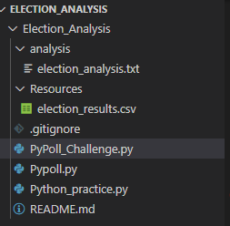
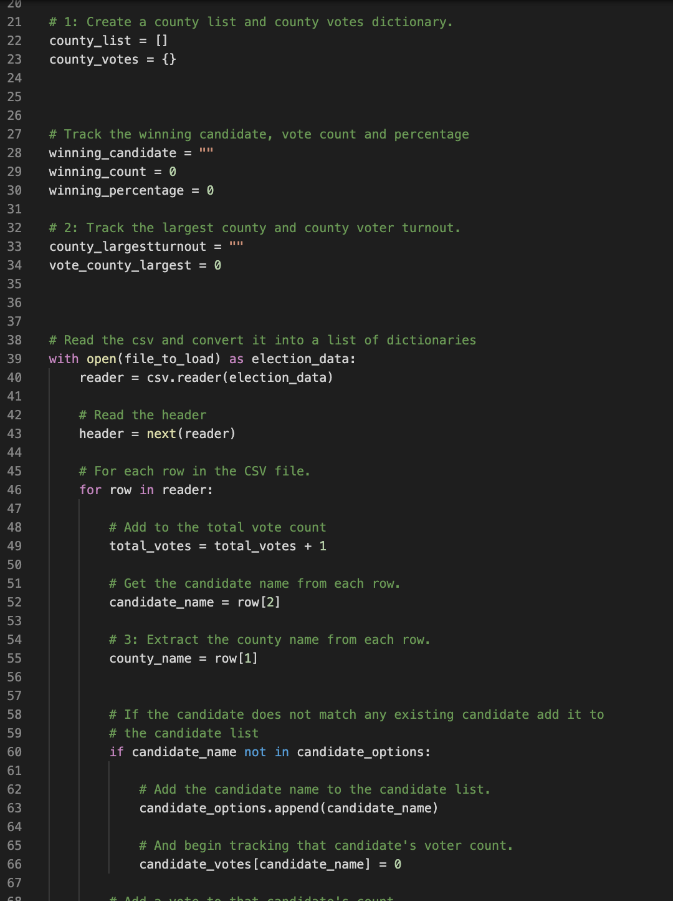
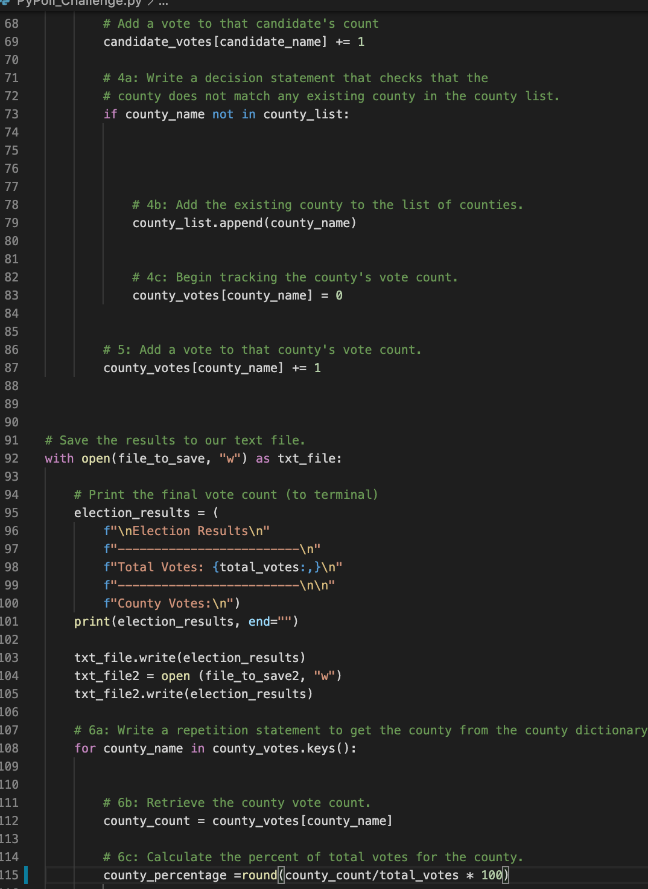
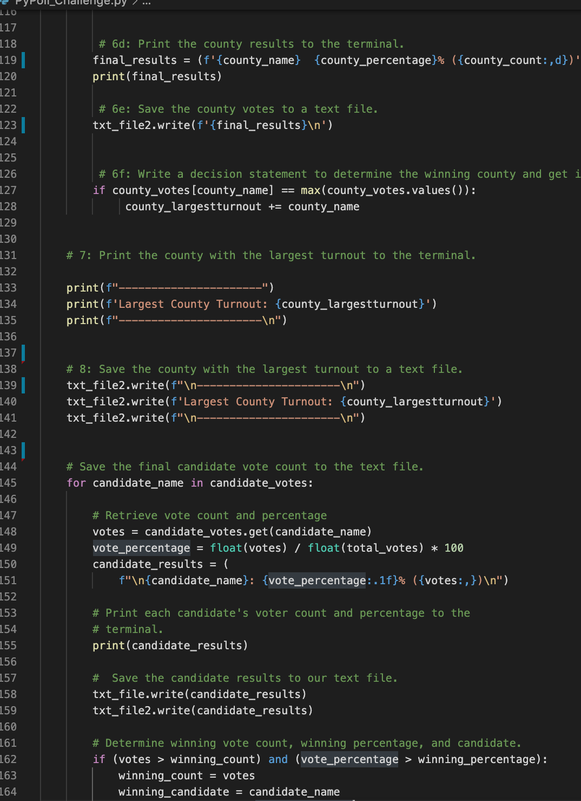
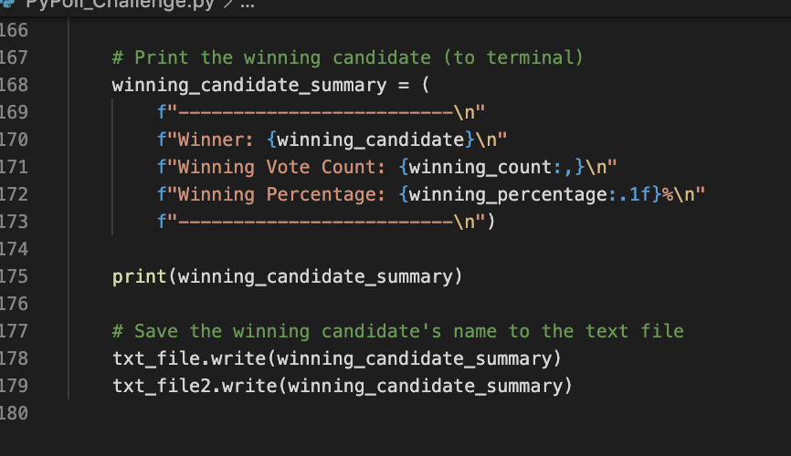

# Election_Analysis

## Project Overview
A Colorado Board of Elections gave me the following tasks to complete the election audit of recent local congressional election.

1. Calculate the total number of votes cast.
2. Get a complete list of counties in the precinct.
3. Get a complette list of the total number of votes cast per county.
4. Calulcate the percentage of votes cast in each county.
5. Determine the county with the largest voter turnout.
6. Get a complete list of candidates who recieved votes.
7. Calculate the percentage of votes each candidate won.
8. Calculate the percentage of votes each candidate won.
9. Determine the winner of the election based on popular vote.

Here is an example of the output requested.

 !

## Files
- Data Source:  election_results.csv
- Software: Python 3.6.1, Visual Studio Code, 1.38.1
  Analysis:
- election_analysis.txt
- election_results.txt

##  Summary of Deliverables
The analysis of the election show that:
- There were "x" votes cast in the election
- The counties were:
  - Countie 1
  - Countie 2
  - Countie 3
- The county results were:
  - County 1 had "x%" of total votes cast and "y" number of votes.
  - County 2 had "x%" of total votes cast and "y" number of votes.
  - County 3 had "x%" of total votes cast and "y" number of votes.
- The county with the highest voter turnnout was:
  - The largest county turnout was in county (1,2,3)
- The candidates were:
  - Candidate 1
  - Candidate 2
  - Candidate 3
- The candidate results were:
  - Candidate 1 revieved "x%" of the vote and "y" number of votes.
  - Candidate 2 revieved "x%" of the vote and "y" number of votes.
  - Candidate 3 revieved "x%" of the vote and "y" number of votes.
- The winner of the election was:
  - Candidate(1,2,3), who recieved "x%" of the vote and "y" number of votes.
  
## Summary: Election-Audit
The script for this local election can easily be used for other county elections as well as any other local election or state wide election with just a few minor changes to the script.  Please note, for all the examples below as well as for any other elections this script may be used for, it is important that the proper data, as in this case, election_results.csv is provided.  To do this simply replace the "election_results.csv" file with another "election_results.csv" file with the appropriate data.  See below.  

!
Using Visual Studio Code, 1.38.1

## Challenge Summary
Changes to code should be made in the following areas.

### Statewide Election
Statewide election while also knowing where the largest voter turn out for the county was.  No need to change the code at all.  Simply replace the original "election_results.csv" file with an updated "election_results.csv" file.  The data should be housed exactly how it is currently housed, just with the additions of new candidates and counties.  Example of how the current "election_results.csv" file looks.

  

  
